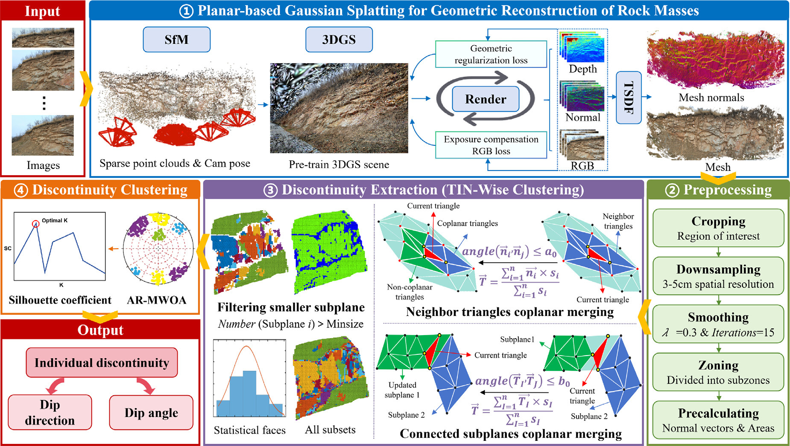
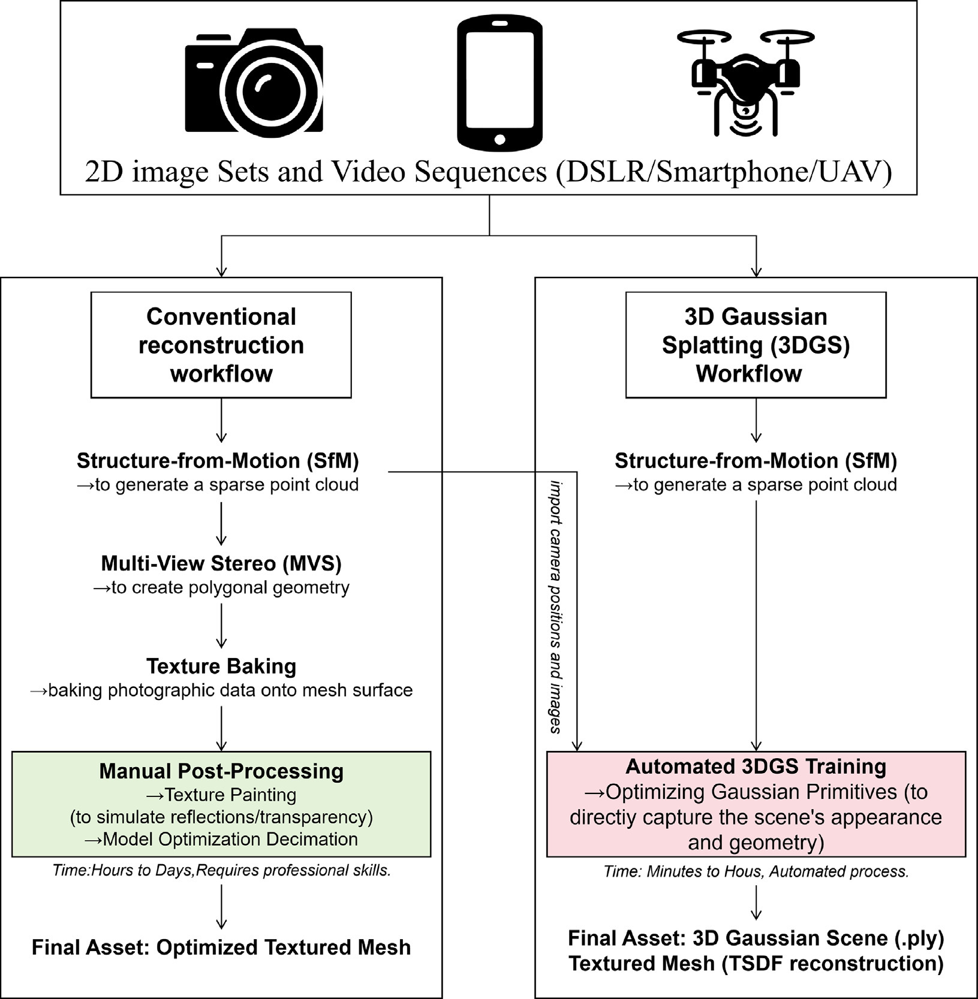
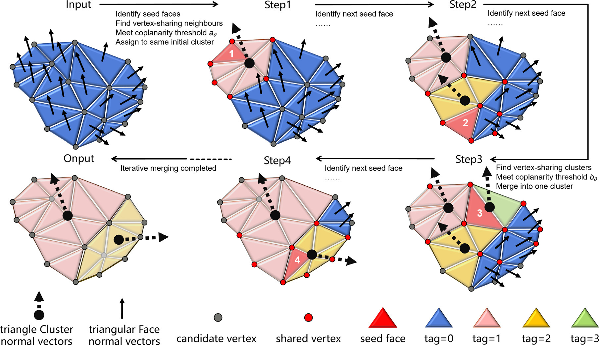
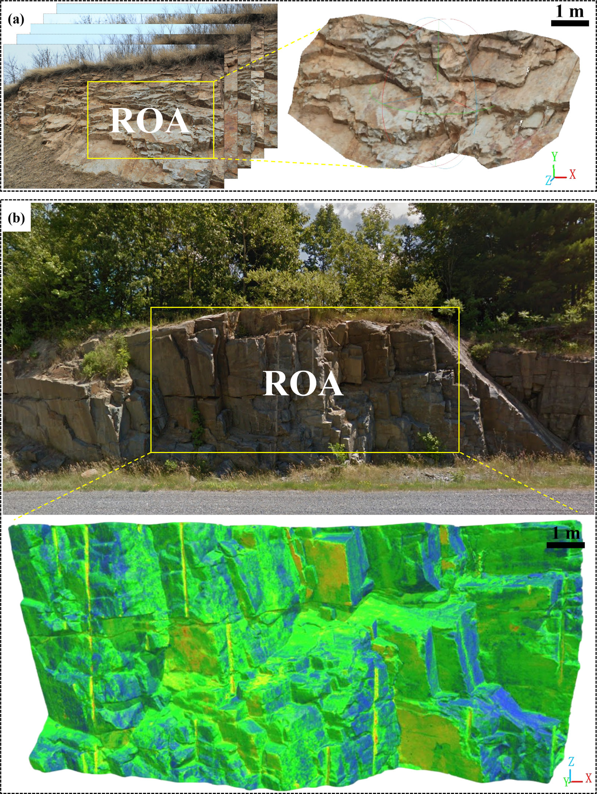
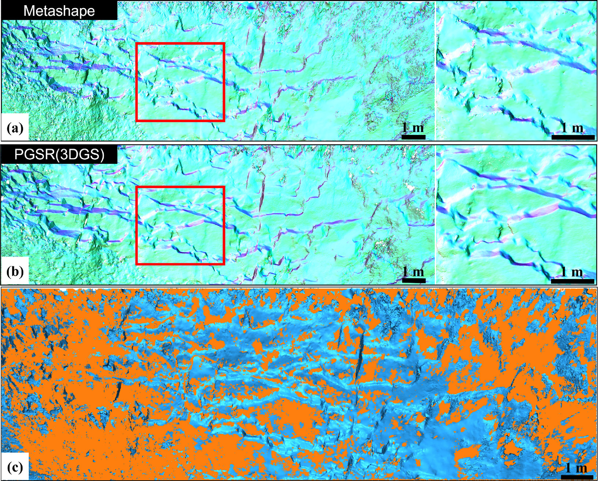
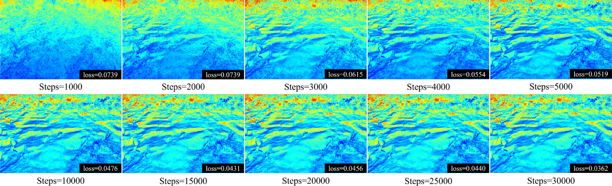

<div align="center">
  <h1>PlanarRock-Discontinuity-GS</h1>
  <p><strong>High-efficiency Reconstruction and Discontinuity Extraction of Rock Mass Outcrops via Planar-based 3D Gaussian Splatting and Triangle-Wise Clustering</strong></p>
  <p>
    <a href="https://www.sciencedirect.com/science/article/pii/S1365160926002765">
      
    </a>
    <a href="#">
      
    </a>
  </p>
</div>

---

## Overview

Accurate identification of rock mass discontinuities is essential for slope stability assessment and geohazard prevention. This project presents a novel framework that combines **Planar-based 3D Gaussian Splatting (PGSR)** with **Triangle-Wise Clustering (TWC)** to achieve high-efficiency reconstruction and discontinuity extraction from rock mass outcrop images.

Our method addresses key limitations of conventional photogrammetry-based workflows, which are often time-consuming and prone to reconstruction distortions under weak textures or complex illumination conditions.

<p align="center">
  
  <br>
  <em>Overall framework of the proposed method: from image acquisition to discontinuity extraction.</em>
</p>

## Key Features

- **High-fidelity Surface Reconstruction**: Leverages PGSR to convert 3D Gaussian primitives into planar representations, significantly improving geometric accuracy
- **Efficient Discontinuity Extraction**: TWC algorithm enables robust clustering of triangular mesh elements for automatic discontinuity identification
- **Scalable Processing**: Optimized pipeline suitable for large-scale rock outcrop scenes
- **Weak Texture Robustness**: Maintains reconstruction quality even under challenging illumination and texture conditions

## Method

Our framework consists of two core components:

### 1. Planar-based 3D Gaussian Splatting (PGSR)

PGSR enhances traditional 3D Gaussian Splatting by compressing 3D Gaussian primitives into 2D planar representations. This approach:
- Preserves the real-time rendering advantages of 3DGS
- Significantly improves surface reconstruction precision
- Reduces geometric noise inherent in unconstrained Gaussian distributions

<p align="center">
  
  <br>
  <em>Comparison between conventional photogrammetry workflow and 3D Gaussian Splatting workflow.</em>
</p>

### 2. Triangle-Wise Clustering (TWC)

TWC operates on the reconstructed mesh to identify planar discontinuity surfaces:
- Clusters mesh triangles based on normal consistency and spatial proximity
- Automatically segments individual discontinuity sets
- Provides geometric parameters (dip, dip direction, spacing) for each set

<p align="center">
  
  <br>
  <em>Triangle-Wise Clustering (TWC) algorithm: iterative coplanar merging process.</em>
</p>

## Pipeline

<p align="center">
  <strong>Input Images</strong> &rarr; <strong>PGSR Reconstruction</strong> &rarr; <strong>Mesh Generation</strong> &rarr; <strong>TWC Clustering</strong> &rarr; <strong>Discontinuity Sets</strong>
</p>

## Results

Our method demonstrates superior performance compared to conventional photogrammetry approaches:

- **Reconstruction Quality**: Higher geometric fidelity on weak-texture rock surfaces
- **Processing Speed**: Significantly faster than traditional SfM+MVS pipelines
- **Extraction Accuracy**: Robust identification of discontinuity sets under varying conditions

### Case Study

<p align="center">
  
  <br>
  <em>Real-world rock slope cases and corresponding 3D reconstruction results.</em>
</p>

### Reconstruction Quality Comparison

<p align="center">
  
  <br>
  <em>Comparison between Metashape (conventional) and PGSR (ours) reconstruction quality, plus discontinuity extraction results.</em>
</p>

### Training Convergence

<p align="center">
  
  <br>
  <em>PGSR training convergence: surface normal quality improves as training steps increase.</em>
</p>

## Citation

If you find this work useful, please cite:

```bibtex
@article{wang2026planarrock,
  title={High-efficiency reconstruction and discontinuity extraction of rock mass outcrops via {Planar-based 3D Gaussian Splatting and Triangle-Wise Clustering}},
  author={Wang, Weijia and Guo, Jiateng and Zhang, Zirui and Cheng, Binbin and Yang, Tianhong},
  journal={International Journal of Rock Mechanics and Mining Sciences},
  volume={207},
  pages={106671},
  year={2026},
  publisher={Elsevier},
  doi={10.1016/j.ijrmms.2026.106671}
}
```

## Acknowledgments

This work builds upon [3D Gaussian Splatting](https://repo-sam.inria.fr/fungraph/3d-gaussian-splatting/) and [PGSR](https://github.com/zju3dv/PGSR). We thank the original authors for their excellent contributions.

## License

This project is released under the MIT License.
